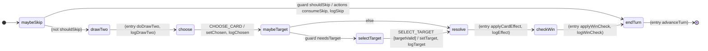

# Turn State Machine

本文档图像化展示 `createTurnMachine` （文件 `src/domain/fsm/machine.ts`）的回合流程。

## Mermaid 状态图

> 可在支持 Mermaid 的 Markdown 预览中查看（GitHub / VSCode 扩展等）。



图例说明：

- `guard xxx` 表示转移受对应条件限制。
- `actions a, b` 表示在该转移动作执行；`(entry ...)` 表示状态进入时执行的动作。
- `[*]` 为起始/终止伪节点。

## ASCII 简化图

```
  [start]
     |
  maybeSkip
    |--(shouldSkip)--> endTurn -> [finish]
    |--(else)--------> drawTwo (entry: doDrawTwo+logDrawTwo)
                           |
                        choose --CHOOSE_CARD--> maybeTarget
                                              /         \
                                 (needsTarget)          (no target)
                                        |                    |
                                   selectTarget         resolve
                                      |  SELECT_TARGET        (entry: applyCardEffect+logEffect)
                                      |  [targetValid]        |
                                      +----------->-----------+
                                                            checkWin
                                                (entry: applyWinCheck+logWinCheck)
                                                            |
                                                          endTurn (entry: advanceTurn)
                                                            |
                                                         [finish]
```

## 状态与职责

| 状态         | 作用                               | 关键动作 / 输出                                  |
| ------------ | ---------------------------------- | ------------------------------------------------ |
| maybeSkip    | 检查当前玩家是否需要被跳过         | `shouldSkip` -> `consumeSkip`, `logSkip`         |
| drawTwo      | 抽两张牌                           | `doDrawTwo`, `logDrawTwo`                        |
| choose       | 等待玩家在两张牌中选择             | `setChosen`, `logChosen`                         |
| maybeTarget  | 根据所选牌是否需要目标决定下个状态 | guard: `needsTarget`                             |
| selectTarget | 等待并验证目标                     | guard: `targetValid`; `setTarget`, `logTarget`   |
| resolve      | 应用卡片效果                       | `applyCardEffect`, `logEffect`（弃置已打出的牌） |
| checkWin     | 执行胜负判定                       | `applyWinCheck`, `logWinCheck`                   |
| endTurn      | 切换玩家，回合结束                 | `advanceTurn`                                    |

## Guards (条件)

| 名称        | 逻辑                                | 失败后流向                    |
| ----------- | ----------------------------------- | ----------------------------- |
| shouldSkip  | `skipNextTurns[currentPlayer] > 0`  | drawTwo                       |
| needsTarget | 所选卡 `def.target.kind !== 'none'` | resolve                       |
| targetValid | 卡牌定义的 `validateTarget` 返回 ok | (保持 selectTarget，直到合法) |

## Actions 摘要

| 动作            | 说明                                                                            |
| --------------- | ------------------------------------------------------------------------------- |
| doDrawTwo       | 复制 deck 状态并抽 2 张（可触发重洗）                                           |
| setChosen       | 记录选中的牌，把未选的那张放入弃牌堆                                            |
| setTarget       | 存储合法目标                                                                    |
| applyCardEffect | 校验 `canPlay` 与目标 -> 生成 ops -> `applyOps` 更新棋盘/状态，并把使用的牌丢弃 |
| applyWinCheck   | 基于当前棋盘扫描五连，处理同时五连策略                                          |
| advanceTurn     | 切换 `currentPlayer`                                                            |
| consumeSkip     | 当前玩家 skip 计数减一                                                          |
| log\*           | 追加结构化日志（tag + 序号）                                                    |

## 事件流（典型有目标卡）

1. maybeSkip -> drawTwo
2. drawTwo (entry 抽牌) -> choose
3. CHOOSE_CARD -> maybeTarget
4. needsTarget 成立 -> selectTarget
5. SELECT_TARGET (合法) -> resolve (应用效果 + 丢牌)
6. -> checkWin (判胜)
7. -> endTurn (换人，回合机结束)

## 扩展建议

- 新增“确认结束”步骤：在 `checkWin` 与 `endTurn` 之间插入 `confirm` 状态，等待 `END_TURN` 事件。
- 支持多目标：把 `selectTarget` 设计成可累计目标的循环，增加事件 `ADD_TARGET`、`CONFIRM_TARGETS`。
- 动画/节奏控制：把一些 `always` 自动跳转换成显式事件（例如 `AFTER_ANIMATION`），让 UI 决定时机。

## 测试

`fsm.test.ts` 会断言日志顺序（`drawTwo -> choose -> selectTarget? -> resolve -> checkWin`）以及上下文变更。图中的每条边都可映射到测试里的一组事件与期望。
